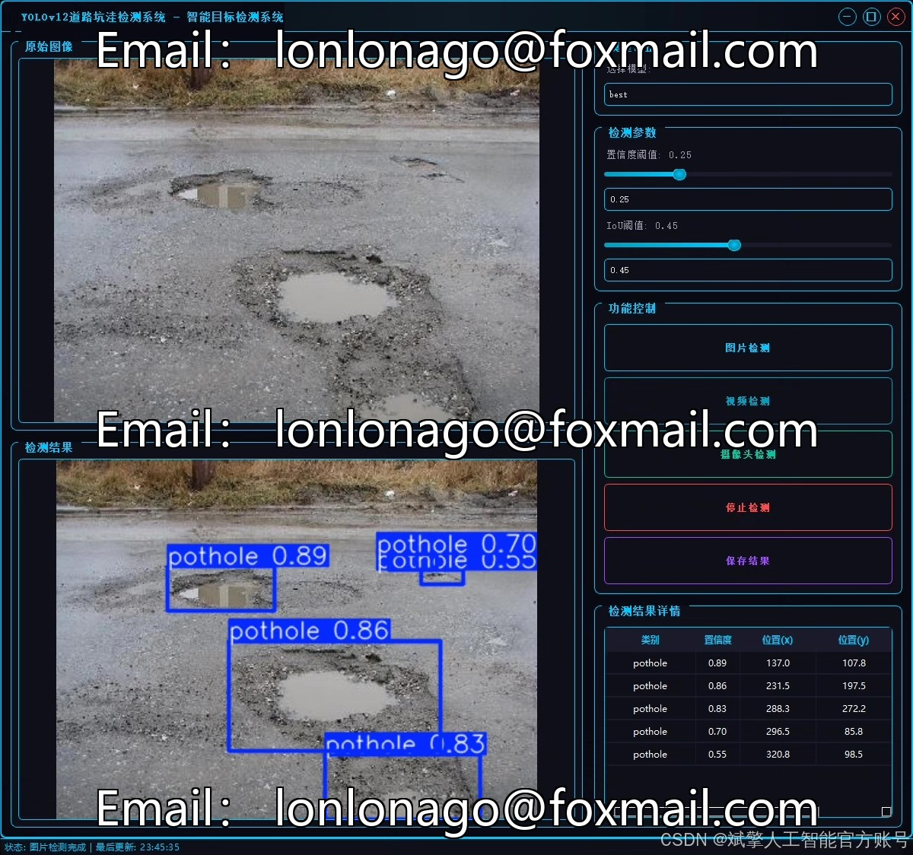
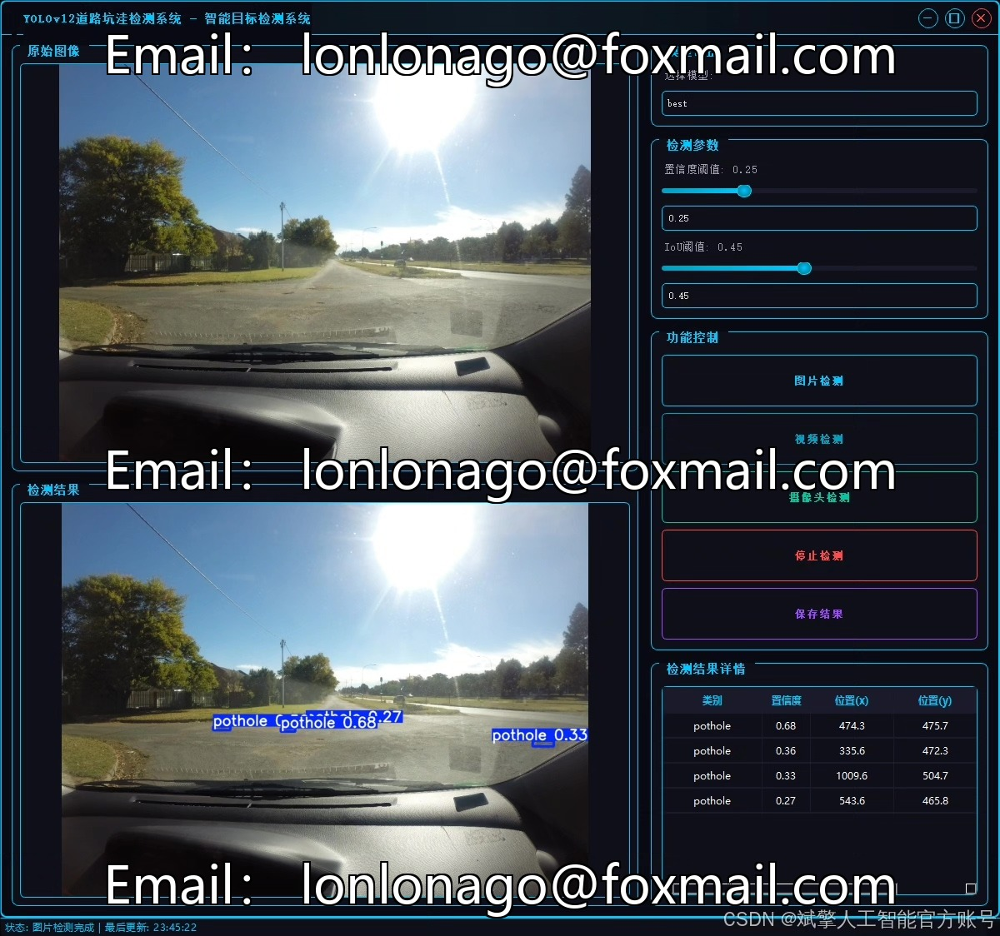
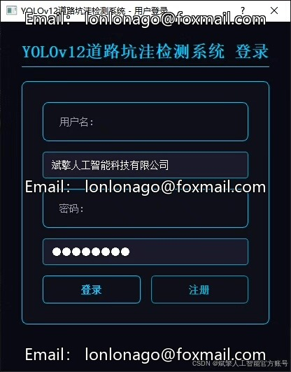
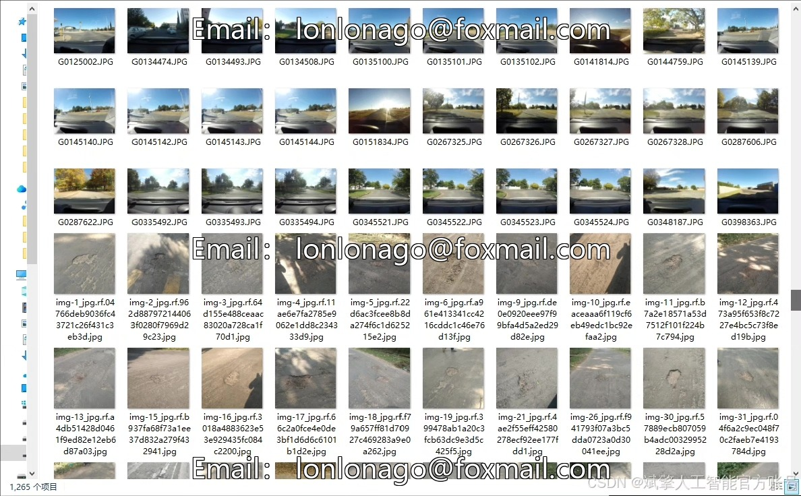
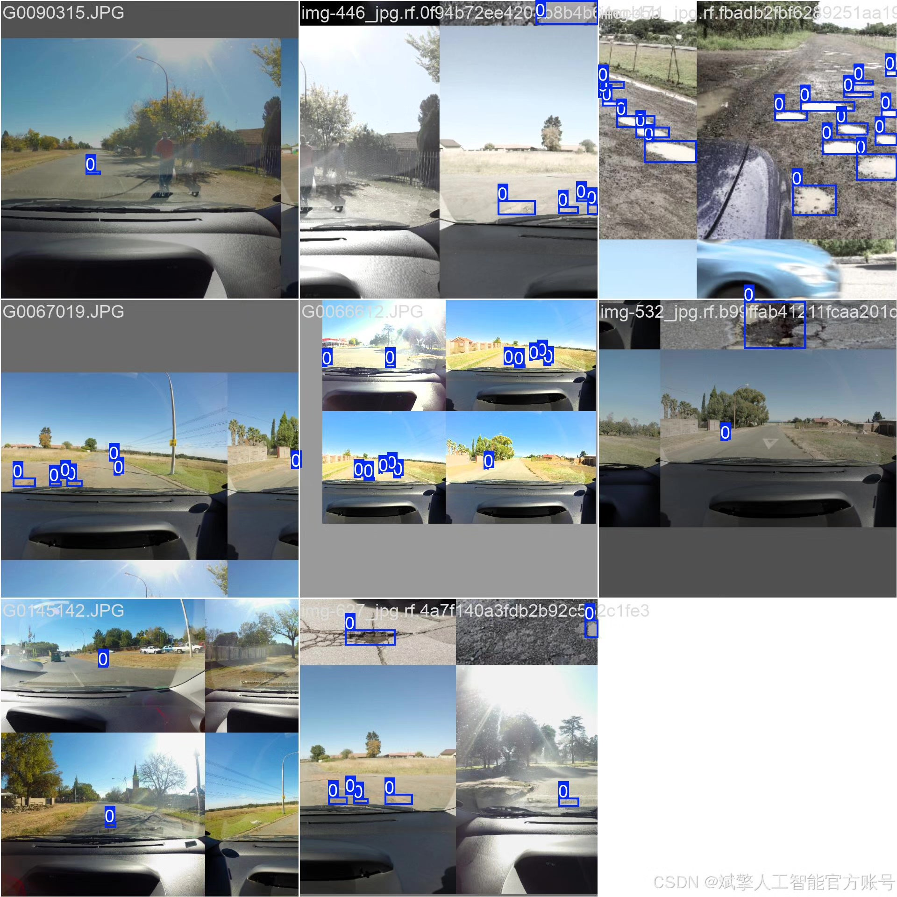
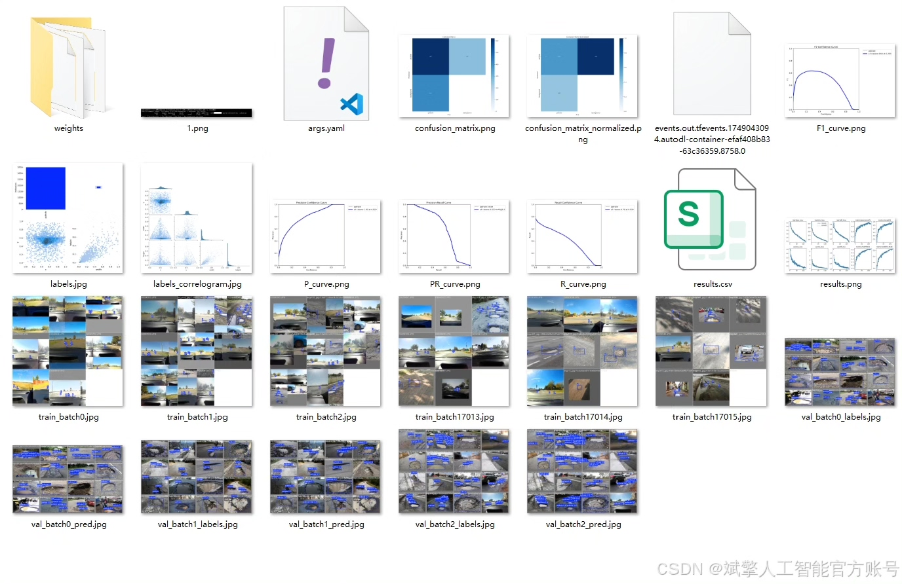
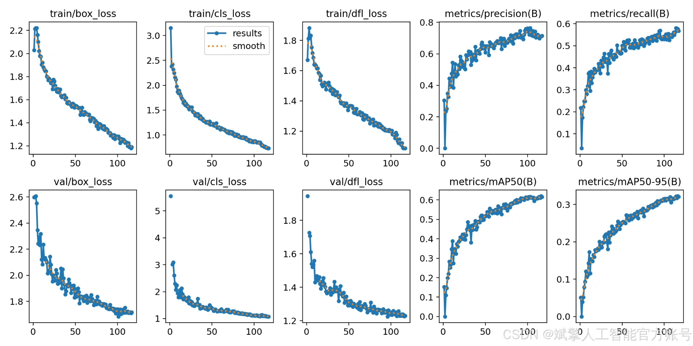
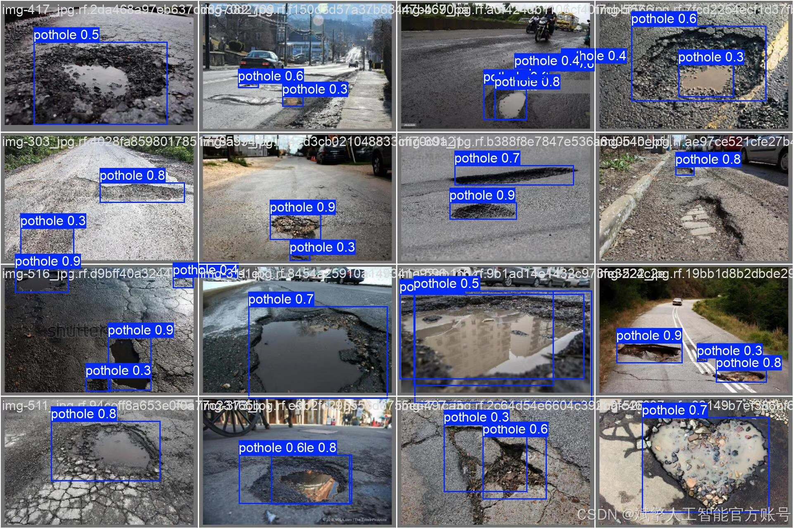

# YOLOv12 Road Ditch Detection System

## Body

YOLOv12 Road Puddle Detection System Based on Deep Learning YOLOv12: A Road Puddle Identification Detection System (YOLOv12+YOLO dataset + UI interface + login registration interface + Python project source code + model)

This paper proposes a road puddle detection system based on deep learning YOLOv12, aiming to achieve efficient and accurate road defect recognition through advanced computer vision technology. The system employs the YOLOv12 object detection algorithm for training and optimization, targeting the single category "pothole". The dataset used includes 1265 training images, 401 validation images, and 118 test images. Additionally, the system is equipped with a user-friendly UI interface that supports login registration functions, facilitating user management and interaction. Experimental results show that the system exhibits high accuracy and robustness in the task of road puddle detection, providing an effective intelligent solution for road maintenance and traffic safety. This paper details the design, implementation, and evaluation process of the system, and provides complete Python project source code and pre-trained models, offering a reference for related research.

✅ User Login Registration: Supports password verification and security validation.
✅ Three detection modes: Based on the YOLOv12 model, supporting image, video, and real-time camera detection, accurately identifying targets.
✅ Dual-screen comparison: Display original images and detection results on the same screen.
✅ Data visualization: Real-time table displaying the category, confidence, and coordinates of detected targets.
✅ Intelligent parameter adjustment: Offers a confidence slide bar for dynamically optimizing detection accuracy, adapting to different scene requirements.
✅ Sci-fi style interactive interface: Dark theme combined with dynamic light effects, reducing visual fatigue and enhancing operational experience.

## Images

## Payment

Here is a pay link on Stripe ( https://buy.stripe.com/3cs8yP7sY87d0vu9AB ). Please contact me lonlonago@foxmail.com after funding $89, and I will send you a complete data files , thank you!

